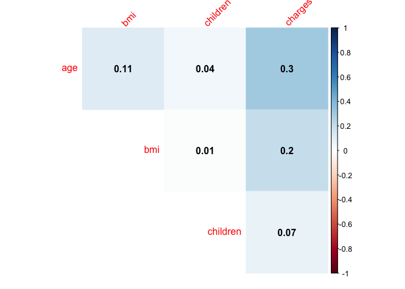
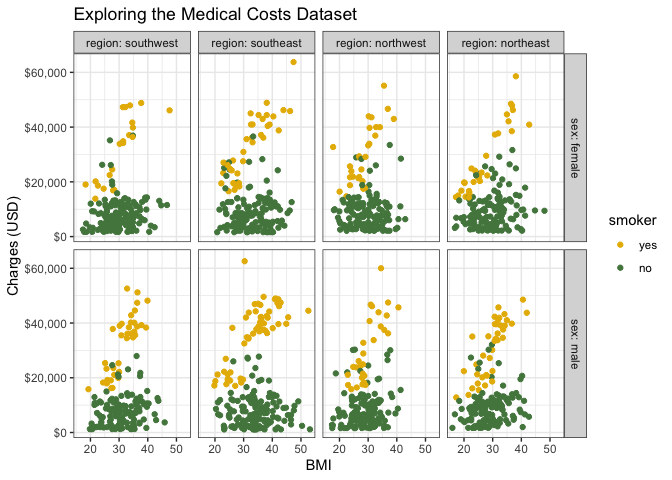
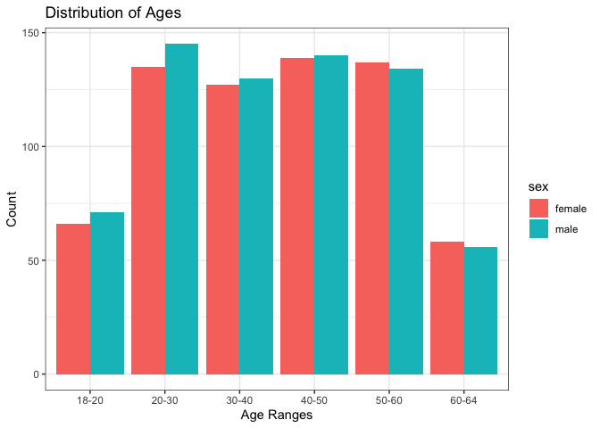
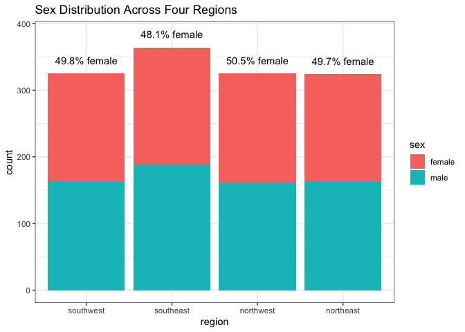

## Introduction

The dataset we have chosen to work with is the "Medical Expenses" dataset used in the book [Machine Learning with R](https://www.amazon.com/Machine-Learning-R-Brett-Lantz/dp/1782162143), by Brett Lantz. This dataset was extracted from [Kaggle](https://www.kaggle.com/mirichoi0218/insurance/home) by Github user [\@meperezcuello](https://gist.github.com/meperezcuello). The information about this dataset has been extracted from their [GitHub Gist](https://gist.github.com/meperezcuello/82a9f1c1c473d6585e750ad2e3c05a41).

This dataset is very interesting as the USA does not have universal healthcare, and is known for bankrupting its citizens with hospital visits despite having insurance. It will be interesting to see the relationship between characteristics of a beneficiary, such as `BMI` and `Smoking` status, and the `charges` incurred.

Originally, this dataset was used to train a machine learning algorithm to accurately predict insurance costs using linear regression.

## Data Description

This dataset explains the medical insurance costs of a small sample of the USA population. Each row corresponds to a beneficiary. Various metadata was recorded as well.


```r
# import the data 
costs <- read_csv(
  here("data", "raw_data", "Medical_Cost.csv"),
  col_types = cols(
    age = col_integer(),
    sex = readr::col_factor(),
    bmi = col_double(),
    children = col_integer(),
    smoker = readr::col_factor(),
    region = readr::col_factor(),
    charges = col_double()
  )
)
```

The columns (except the last one) in this dataset correspond to metadata, where the last column is the monetary charges of medical insurance:

```r
colnames(costs)
```

```
## [1] "age"      "sex"      "bmi"      "children" "smoker"   "region"   "charges"
```

Here are the possible values for each of the above column names:

Variable | Type | Description
---------|------|---------------
Age | integer | the primary beneficiary's age in years
Sex | factor | the beneficiary's sex: `female` or `male`
BMI | double | the beneficiary's Body Mass Index, a measure of their body fat based on height and weight (measured in kg/m<sup>2</sup>), an ideal range of 18.5 to 24.9
Children | integer | the number of dependents on the primary beneficiary's insurance policy
Smoker | factor | whether or not the beneficiary is a smoker: `yes` or `no`
Region | factor | the beneficiary's residential area in the USA: `southwest`, `southeast`, `northwest`, or `northeast`
Charges | double | the monetary charges the beneficiary was billed by health insurance

## Exploring the Dataset

Here is a summary of the dataset, and the values of each variable:

```r
summary(costs)
```

```
##       age            sex           bmi           children     smoker    
##  Min.   :18.00   female:662   Min.   :15.96   Min.   :0.000   yes: 274  
##  1st Qu.:27.00   male  :676   1st Qu.:26.30   1st Qu.:0.000   no :1064  
##  Median :39.00                Median :30.40   Median :1.000             
##  Mean   :39.21                Mean   :30.66   Mean   :1.095             
##  3rd Qu.:51.00                3rd Qu.:34.69   3rd Qu.:2.000             
##  Max.   :64.00                Max.   :53.13   Max.   :5.000             
##        region       charges     
##  southwest:325   Min.   : 1122  
##  southeast:364   1st Qu.: 4740  
##  northwest:325   Median : 9382  
##  northeast:324   Mean   :13270  
##                  3rd Qu.:16640  
##                  Max.   :63770
```

### Correllogram

According to the correllogram below, age and charges has the strongest positive correlation of 0.3. The second strongest positive correlation is 0.2, between BMI and charges.


```r
# remove the factors to do correlation
costs_correlations <- costs %>%
  select(-sex,-smoker, -region) %>%
  cor()

costs_correlations <- round(costs_correlations,2)
corrplot(costs_correlations,
         type = "upper",
         method = "color",
         tl.srt=45,
         addCoef.col = "black",
         diag = FALSE)
```

<!-- -->

### Faceted Plot

While the data between regions and sex does not appear to vary much, the smokers vs nonsmokers of each facet appear to cluster together, with the non-smokers having an overall lower medical cost.

```r
ggplot(costs, aes(x=bmi, y=charges, colour = smoker)) + 
  geom_point() +
  theme_bw() +
  facet_grid(sex ~ region, labeller = label_both) +
  labs(x = 'BMI',
       y = 'Charges (USD)',
       title = "Exploring the Medical Costs Dataset") +
  scale_y_continuous(labels = dollar)
```

<!-- -->

### Histogram
Looking at the dataset, there appears to be more beneficiaries in the 20-60 age range.

```r
costs %>% 
  mutate(age_range = case_when(
    age < 20 ~ glue("{min(age)}-20"),
    age >= 20 & age < 30 ~ "20-30",
    age >=30 & age < 40 ~ "30-40",
    age >=40 & age < 50 ~ "40-50",
    age >=50 & age < 60 ~ "50-60",
    age >=60 & age <= max(age) ~ glue("60-{max(age)}")
    
  )) %>%
  ggplot(aes(x=age_range)) +
  geom_bar() +
  ggtitle("Distribution of Ages") +
  xlab("Age Ranges") +
  ylab("Count")
```

<!-- -->

### Stacked Bar Chart
This plot shows the distribution of sex in each of the four regions. At a glance, the dataset looks very even when it comes to sex, but there are slightly more beneficiaries in the southeast.

```r
costs %>%
  group_by(sex, region) %>%
  summarize(count = n()) %>%
  ggplot(aes(fill = sex, x = region, y=count)) +
  geom_bar(position="stack", stat="identity") +
  ggtitle("Sex Distribution Across Four Regions")
```

<!-- -->

## Research Question
Does having an increased BMI increase your insurance costs? What about age? Number of dependents? Smoking status?

Are certain areas of the USA associated with higher insurance costs?

## Plan of Action
Our plan of action is...

## References
1. Medical Costs Dataset - https://gist.github.com/meperezcuello/82a9f1c1c473d6585e750ad2e3c05a41
2. BMI - https://www.nhlbi.nih.gov/health/educational/lose_wt/BMI/bmi-m.htm
